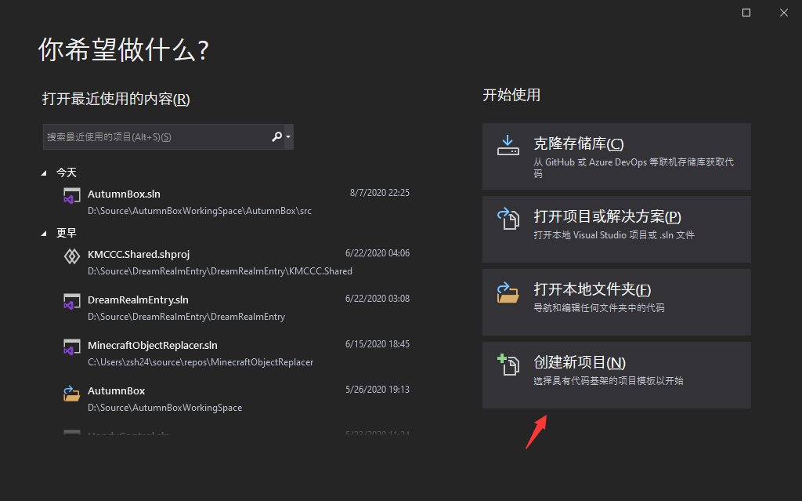
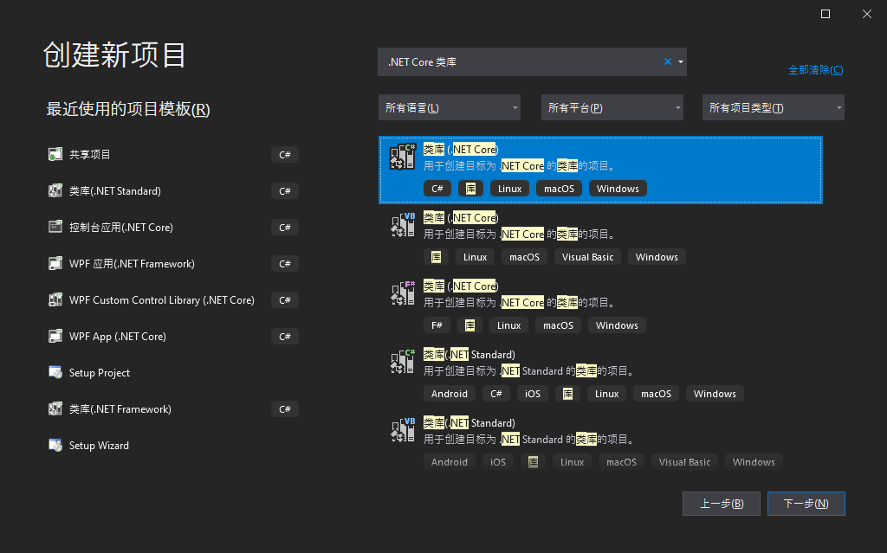
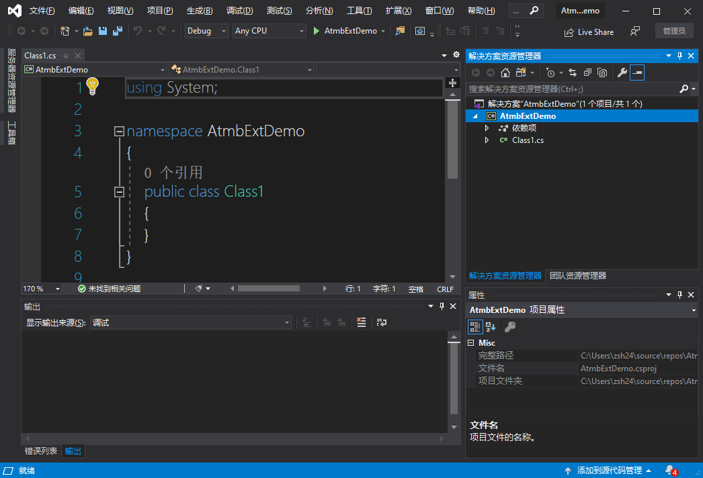
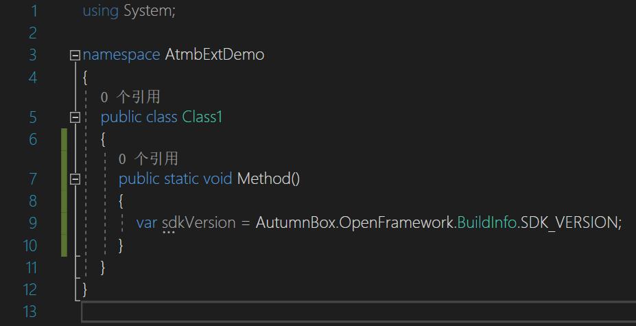
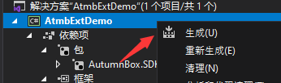
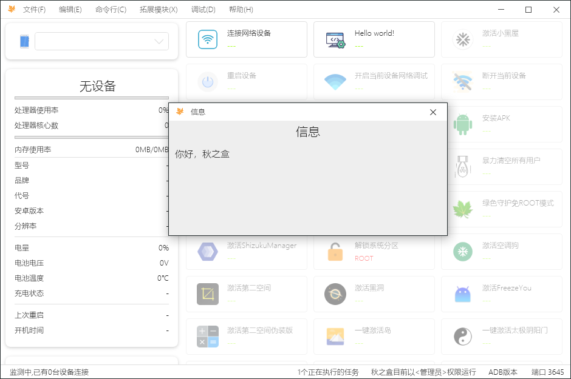

# 1.创建项目
## 1.1 创建新项目
打开`Visual Studio 2019`，点击右下角`创建新项目`

## 1.2 选择合适的目标
选择`.Net Core类库`

值得注意的是，如果您的拓展模块中需要编写`WPF`控件，请在这一步时选择`WPF Custom Control Library`或`WPF User Control Library`   


## 1.3 填写项目信息


## 1.4 完成
此时,我们得到了一个不包含任何实际业务逻辑的空项目。

# 2.安装秋之盒SDK
## 2.1 打开Nuget管理界面
::: tip 什么是Nuget?
`NuGet`是.NET项目的一种包管理器，我们可以通过其在线安装与管理项目的依赖程序集。   
`NuGet`之于`C#`，就好像`npm`之于`JavaScript`，`Maven`之于`Java`，`PIP`之于`Python`,`apt`之于`Debian`
:::
右键项目，点击`管理NuGet程序包`
便可以打开NuGet包的管理界面了，我们可以在这里搜索，安装，更新，卸载`NuGet`包。

## 2.2 搜索并安装秋之盒SDK
在搜索框搜索`AutumnBox.SDK`即可找到秋之盒SDK。

点击安装后，秋之盒SDK就会被以依赖的形式引入到你的项目中了。


搜不到秋之盒SDK怎么办?
请在搜索时修改源为nuget   


## 2.3 检查
在`Class1.cs`中编写一段简单的代码，这段代码调用了秋之盒SDK的中获取SDK版本的接口，没有任何错误提示。

至此，秋之盒SDK安装完毕，请删除掉自动生成的无用`Class1.cs`。

# 3.第一个拓展模块
万事俱备，是时候创建自己的第一个秋之盒拓展模块了。
## 3.1 新建拓展模块类
新建一个名为`EHelloAutumnBox`，并且使其继承于`AutumnBox.OpenFramework.Extension.Leaf.LeafExtensionBase`
```Java
using AutumnBox.OpenFramework.Extension.Leaf;
namespace AtmbExtDemo
{
    class EHelloAutumnBox : LeafExtensionBase
    {
    }
}
```
## 3.2 添加主要方法
在类中加入一个主要方法，名称与修饰符随意，但需要挂上`LMain`特性。
```Java
using AutumnBox.OpenFramework.Extension.Leaf;
namespace AtmbExtDemo
{
    class EHelloAutumnBox : LeafExtensionBase
    {
        [LMain]
        public void Run(){
            //业务逻辑
        }
    }
}
```
## 3.3 编写逻辑
在刚刚创建的主要方法中，填入逻辑。这里，跟随我的步伐，写入以下内容：
```Java
using AutumnBox.OpenFramework.Extension;
using AutumnBox.OpenFramework.Extension.Leaf;
using AutumnBox.OpenFramework.Open;

namespace AtmbExtDemo
{
    [ExtName("Hello world!")]
    [ExtRequiredDeviceStates(AutumnBoxExtension.NoMatter)]
    class EHelloAutumnBox : LeafExtensionBase
    {
        [LMain]
        public void Run(IUx ux)
        {
            ux.Message("你好，秋之盒");
        }
    }
}
```
#### Q: class上面是啥?
在秋之盒拓展模块的设计中，你的拓展模块信息通过`特性(Attribute)`来表达。`ExtName`表明了这个拓展模块的名字，`ExtRequiredDeviceStates`表明了这个拓展模块执行所需求的安卓设备状态，这里我们使用`AutumnBoxExtension.NoMatter`表示"管他设备有没有连接,管它设备什么状态,我这模块都能跑!"
:::tip
`C#`的特性(Attribute)类似于`Java`中的注解，`JS`中的装饰器。
:::
#### Q: 主要方法多了个参数?
可以观察到，我们在主要方法的参数列表中加入了一个`AutumnBox.OpenFramework.Open.IUx`类型的参数，这表明我们向秋之盒请求了`IUx`编程接口，这个接口提供了一些系列最基础的用户交互方式。
当拓展模块被执行时，秋之盒将自动扫描主方法参数列表,并将请求的接口传入，这就是最基础的依赖注入。
#### Q: 主要方法的逻辑?
之后，我们调用`IUx`接口提供的Message方法以向用户发送一条需要确认的信息。
#### Q: 不需要写类似Manifest的东西?
不需要，秋之盒使用反射技术自动查找程序集中的拓展模块。
#### Q：类的修饰符和入口修饰符为什么不是public?
秋之盒使用反射技术查找拓展模块类及其主要方法时会忽略其修饰符，即便是`private`。
:::tip
如果想要隐藏你的拓展模块，可以在class上添加`[ExtHidden]`特性
:::
## 3.4 构建
右键项目，点击生成。


如果没有语法错误的话，构建将是成功的，在构建输出中我们可以看到构建出来的类库文件在哪里。
```
1>------ 已启动生成: 项目: AtmbExtDemo, 配置: Debug Any CPU ------
1>AtmbExtDemo -> C:\Users\zsh24\source\repos\AtmbExtDemo\AtmbExtDemo\bin\Debug\netcoreapp3.1\AtmbExtDemo.dll
========== 生成: 成功 1 个，失败 0 个，最新 0 个，跳过 0 个 ==========
```

# 4.你好,秋之盒
## 4.1 安装模块
将构建出来的`.dll`文件放置到秋之盒程序目录下的`extensions`文件夹中。

## 4.2 大功告成
启动秋之盒，点击我们编写的模块即可运行。


离成功不远了！秋之盒拓展模块的框架设计非常简单，如果足够认真，接下来再花上一个小时你就能真正上手了！