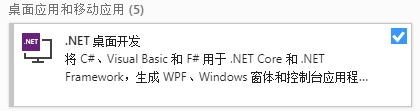

开发秋之盒，或进行秋之盒拓展模块开发，至少需要`.NET Core SDK`。而进行`.NET Core`开发的最好工具就是`Visual Studio`了。
### 安装Visual Studio 2019
- 点击下载最新的`Visual Studio Installer` >>> [Visual Studio Best-in-class tools for any developer](https://visualstudio.microsoft.com/)
- 打开安装器并勾选`.NET桌面开发`   

- 安装完毕即可