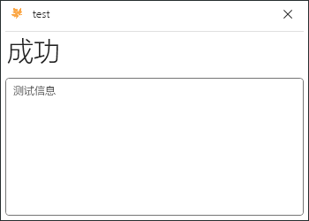

前面的学习中我们使用了`IUx`接口显示了一个"Hello World"消息，这实在是太原始了！我们应当使用与叶之拓展配套的叶之界面!

## 简单的例子
没啥好说的，看代码吧
```java
//通过LeafExtension提供的依赖注入获取到一个新的ILeafUI对象
void Main(ILeafUI ui){
    ui.Show();
    ui.StatusInfo = "AB";
    ui.ShowMessage("Hello!");
    ui.Println("Test");
    ui.Finish();
}
```
   
   
未完待续。