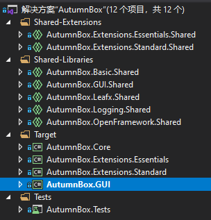

# 详解
此图为秋之盒目前的项目结构，其中部分项目包含实际的逻辑代码，而部分项目仅作为编译目标使用。
## Shared-Libraries
这个文件夹中的项目包含了各程序模块的实际逻辑，当你需要阅读与修改代码时，参考这里即可。
#### AutumnBox.Basic.Shared
对ADB命令行进行包装，向C#提供了与ADB交互的能力。
#### AutumnBox.Leafx.Shared
一系列高级工具，包括依赖注入，控制反转等，在整个秋之盒各处都有所应用。
#### AutumnBox.Logging.Shared
秋之盒中的日志系统，为所有程序模块提供日志能力。
#### AutumnBox.OpenFramework.Shared
拓展模块的管理系统，构建拓展模块与秋之盒之间的桥梁。
~~就好像Forge Mod Loader之于Minecraft~~
## Shared-Extensions
包含一些拓展模块的实际逻辑代码与其所需的资源文件。
#### AutumnBox.Extensions.Essentials.Shared
提供最基础的秋之盒拓展模块，如设备重启器，网络设备连接器等。如果缺少这个程序集，秋之盒的各项基础能力将面临崩溃。
#### AutumnBox.Extensionss.Standard.Share
包含标准的秋之盒拓展模块，如各类DPM软件激活器等，非必要，但通常随秋之盒一同构建与发布，也可视为秋之盒的重要部分。
## Target
这个文件夹中的项目主要是面向实际的构建过程与具体平台的。
#### AutumnBox.Core
基于`.Net Core 3.1`的动态类库项目。其中包含了`Logging`,`OpenFramework`,`Basic`,`Leafx`的逻辑代码，可编译为`AutumnBox.Core.dll`。
#### AutumnBox.GUI
基于`.NET Core 3.1`的WPF界面项目，其中包含了图形界面相关代码，并起到将各程序模块编织在一起的效果。是面向用户的秋之盒主程序。可编译为`AutumnBox.GUI.exe`
#### AutumnBox.Extensions.Essentials与Standard
是分别包含了`Essentials`与`Standard`拓展模块的面向`.Net Core 3.1`的动态类库程序集，随秋之盒主程序构建，并被放置到拓展模块文件夹中。
