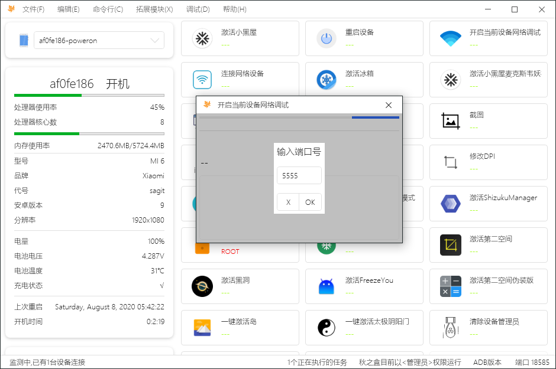
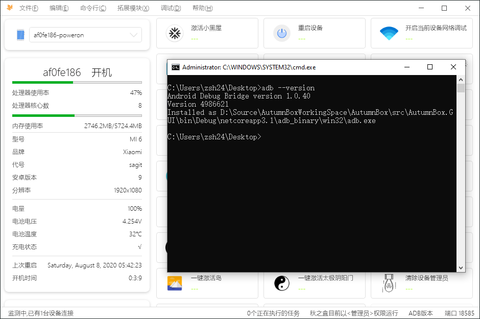
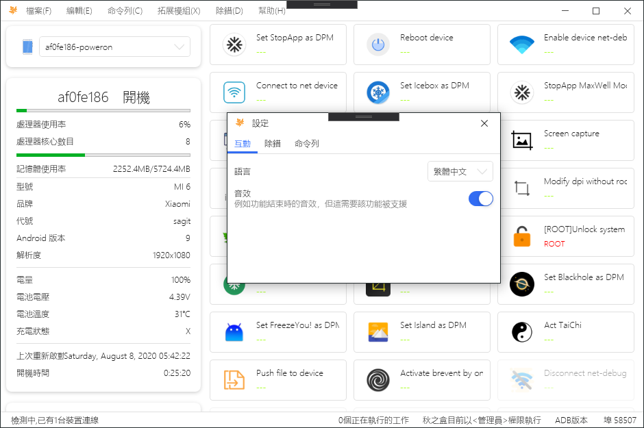
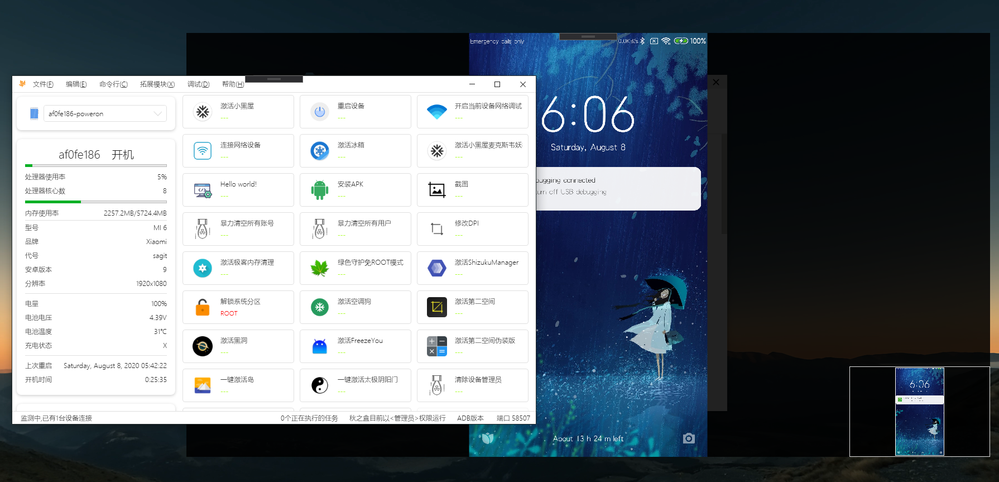

你是否已经等待了太久?
现在，终于是时候开始新的征程了...

# 2020.8版本进入早期测试阶段
在将来的至少一年内,2020.8将作为主要支持版本存在。

## 主要变化
* 使用HandyControl重做界面
* 大量底层逻辑修改
* 使用AppCenter进行跟踪
* 使用.Net Core 3.1作为框架,并且自带完整运行时，无需单独下载。
* 基础的SDK 11.7实现
:::danger
早期测试版本可能是危险的,任何使用者都应做好彻底刷机以及丢失数据的准备。
:::
## 立刻下载
* [百度云 提取码: 9qbs](https://pan.baidu.com/s/17TtF4I43mYL09LPsvHIruw)
* [蓝奏云 提取码: 3z2n](https://wwa.lanzous.com/b08xidfzi)
## 问题反馈
开[Issues](https://github.com/zsh2401/AutumnBox/issues)或直接本页面评论区留言。

## 预览图

